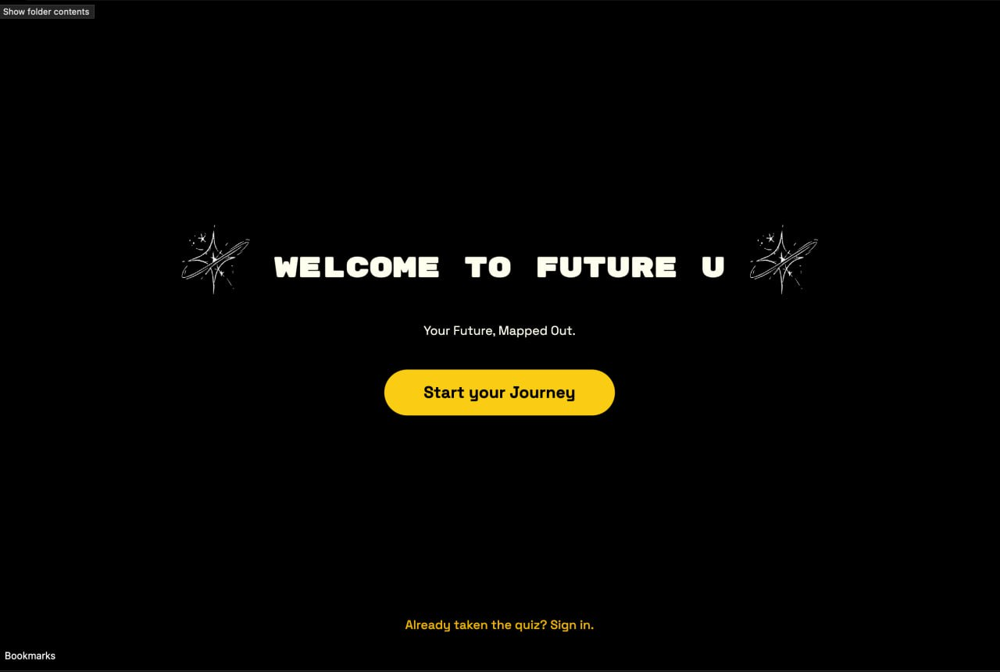

# Hi, I'm Michelle Lawson 🦩✨

  

  
   
  <i>"Software Engineer & Product Founder bridging the gap between AI Innovation and Gen Z Lifestyle."</i> 💅

Building **AI-powered tools** and **mobile applications** that help people design their dream lives. I'm a **Smith College '26** Computer Science student, a community builder for 200k+ **women in tech**, and a **Builder** who ships efficient **Full-Stack** code.

---

## 🏗️ The "10 Apps in 10 Weeks" Challenge
A showcase of **Agile Development** and **Rapid Prototyping**. I am shipping 10 production-ready products to solve real problems for the **Gen Z audience**.

<table>
  <tr>
    <td width="50%" valign="top">
      <h3>01. Sprite Sheet Generator</h3>
      
      
Frontend Tooling for high-speed asset creation. Built to automate the "boring stuff" for game devs.

      <a href="https://github.com/lawsonM525/sprite-sheet-generator">Repo</a> | <a href="#">Demo</a>
    </td>
    <td width="50%" valign="top">
      <h3>02. Future U (BETA)</h3>
      
      
AI-Powered Career Coaching and path mapping. Built with Next.js 14 and OpenAI. 💜

      <a href="https://github.com/lawsonM525/future-u">Repo</a> | <a href="#">Live App</a>
    </td>
  </tr>
  <tr>
    <td width="50%" valign="top">
      <h3>03. Pagez</h3>
      
      
Relationship & habit journaling using AI-driven Knowledge Graphs. Personal CRM for the soft life.

      <a href="#">Coming Soon</a>
    </td>
    <td width="50%" valign="top">
      <h3>04. Dreamz</h3>
      
      
React Native mobile lifestyle integration for high-performance productivity.

      <a href="https://github.com/lawsonM525/Dreamz">Repo</a>
    </td>
  </tr>
  <tr>
    <td width="50%" valign="top">
      <h3>05. Vibecut</h3>
      
      
Programmatic video editing agent. Turning prompts into social-ready edits. 🎥

      <a href="#">In Dev</a>
    </td>
    <td width="50%" valign="top">
      <h3>06. Daily</h3>
      
      
SaaS journaling app built on ChatGPT Apps SDK. Simple, elegant, efficient.

      <a href="https://github.com/lawsonM525/daily">Repo</a>
    </td>
  </tr>
</table>

---

## 🛠️ Performance Tech Stack
Expertise in **Full Stack Development**, **AI Integration**, and **Mobile App Engineering**.

   &nbsp;
   &nbsp;
   &nbsp;
   &nbsp;
  

---

## 🧠 Technical Deep Dives
- **M++:** A high-level **Compiler** built using [Brainfuck](https://en.wikipedia.org/wiki/Brainfuck) — mapping esoteric logic to usable code. 🤯
- **System Architecture:** Scalable **Full-Stack** applications and **API Design**.

---

## 📚 Recursive Mind Library
Building a "Recursive Mind" one page at a time.

<table>
  <tr>
    <td width="20%" align="center">
       
       
      <b>Da Vinci</b>
    </td>
    <td width="20%" align="center">
       
       
      <b>Adweek</b>
    </td>
    <td width="20%" align="center">
       
       
      <b>Squibb</b>
    </td>
    <td width="20%" align="center">
       
       
      <b>Hesse</b>
    </td>
    <td width="20%" align="center">
       
       
      <b>Naval</b>
    </td>
  </tr>
  <tr>
    <td width="20%" align="center">
       
       
      <b>Utopia</b>
    </td>
    <td width="20%" align="center">
       
       
      <b>Go-Giver</b>
    </td>
    <td width="20%" align="center">
       
       
      <b>Alchemist</b>
    </td>
    <td width="20%" align="center">
       
       
      <b>Show Work</b>
    </td>
    <td width="20%" align="center">
      <!-- Placeholder -->
    </td>
  </tr>
</table>

---

## 📊 Analytics

  
  

---

## 🌸 Connect with michellescomputer
[Portfolio](https://michellelawson.me) | [TikTok](https://tiktok.com/@michellescomputer) | [Instagram](https://instagram.com/michellexcomputer) | [LinkedIn](https://linkedin.com/in/michelle-o-lawson/)

**"You can achieve anything that you can imagine. Seriously."** — Building intentional **AI for Gen Z**. 🧱✨
